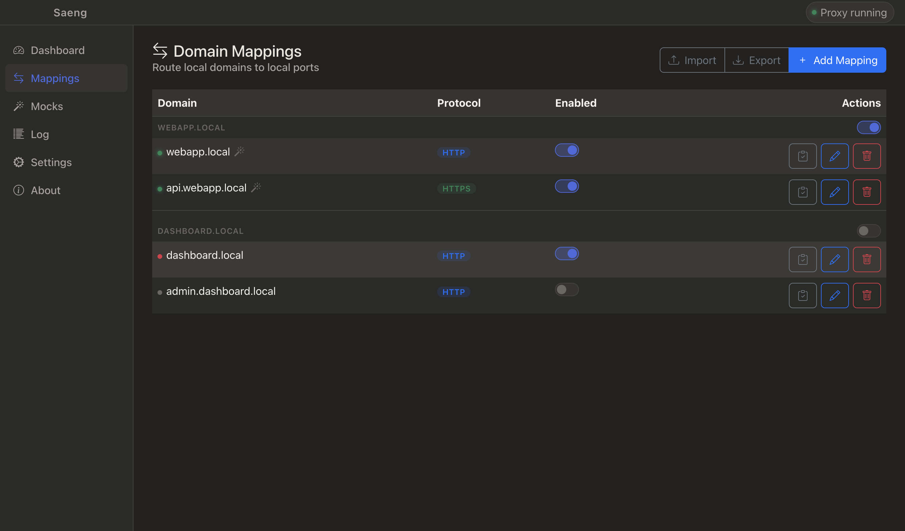
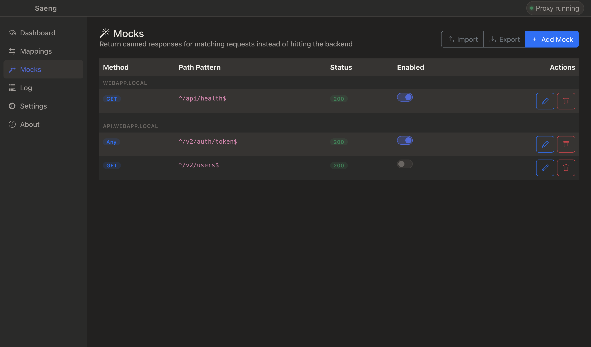
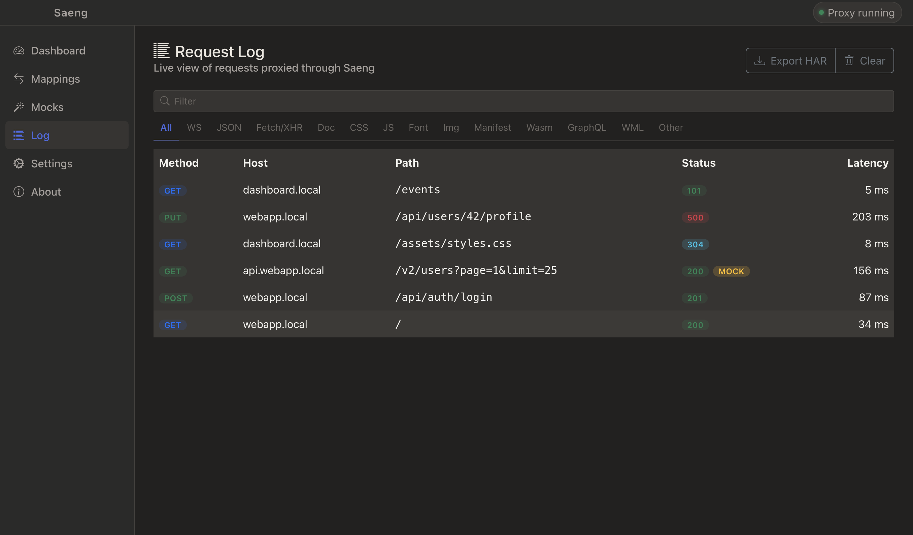
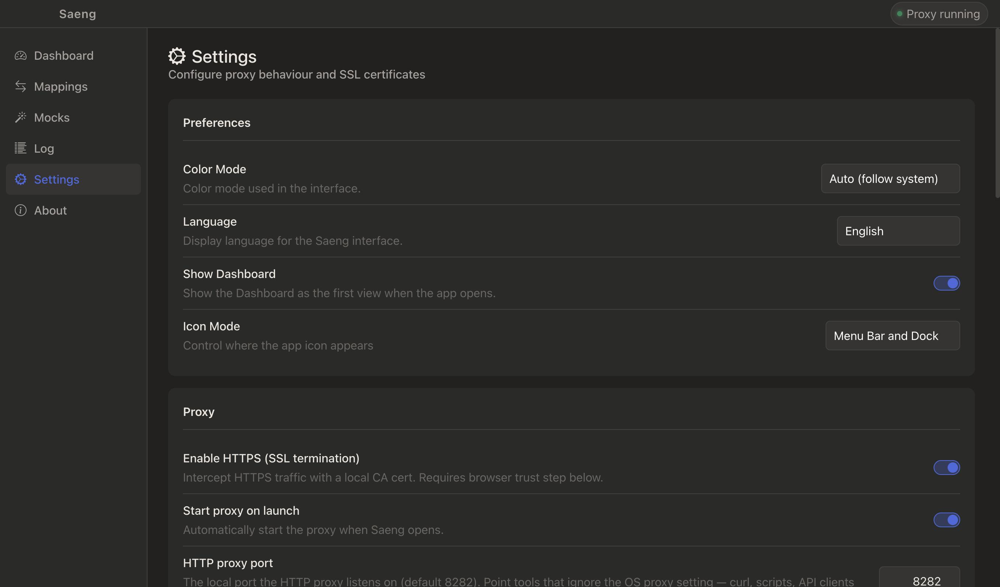
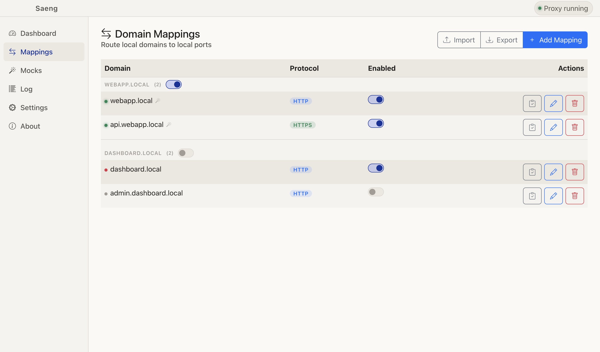
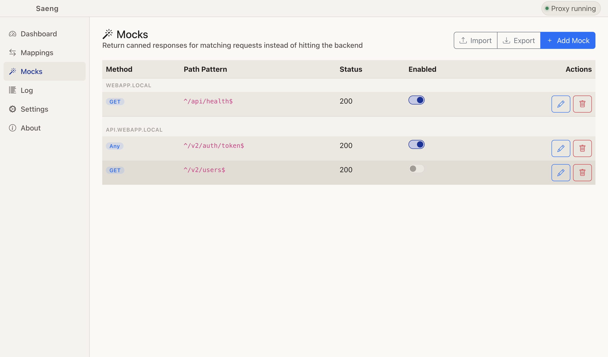
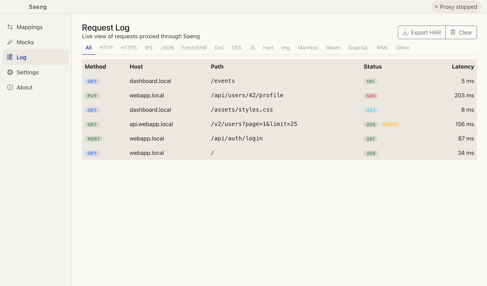
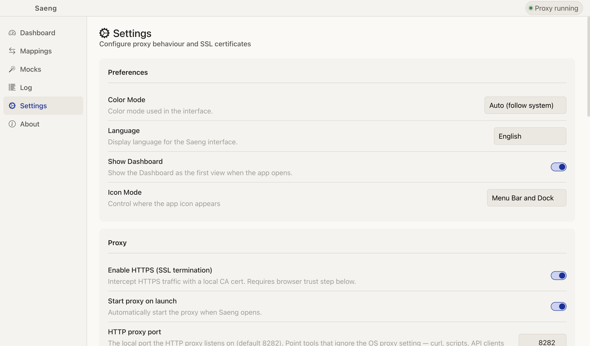

Local domain proxy manager for local development domains.

Saeng routes local defined domains to localhost ports using a PAC (Proxy Auto-Config) file — no `/etc/hosts` edits, no elevated port binding, no `sudo`. Add a mapping, start the proxy, and `http://myapp.local` goes straight to your local server.

Saeng works on macOS, Windows, and Linux.

Saeng means "light," "radiance," or "glow" in Thai.

|  | Mappings | Mocks | Logs | Settings |
| :---: | :---: | :---: | :---: | :---: |
| Dark |  |  |  |  |
| Light |  |  |  |  |

## How it works

1. Saeng starts a local PAC file server on port `8181` and configures the OS system proxy to point to it.
2. After the domain is set up in Saeng, when a browser navigates to the local domain, the PAC file tells it to route through Saeng's HTTP proxy.
3. The proxy looks up the domain in your mappings and forwards the request to `localhost:<port>`.
4. On quit, the system proxy setting is restored.

HTTPS works by intercepting `CONNECT` tunnel requests and terminating TLS using a locally generated CA certificate. You install that CA cert into your OS trust store once; Saeng handles per-domain leaf certificates automatically.

> NOTE: Saeng may not work for you straight out the box. Your application may still need to be updated to accept the domain as an available host

## Download & Install

All releases are available from [Github](https://github.com/dfreerksen/saeng/releases/).

If you are on an Intel chip (x86_64) Mac, you want the x64 dmg. If you are on a Apple Silicon chip (M1/M2/M3/etc.) Mac, you want the arm64 dmg. 

## Features

* Map any local domain (with or without subdomain) to a local port
* Mappings are grouped by base domain, with a toggle to enable/disable a whole group at once
* Enable/disable individual mappings without removing them
* Per-mapping custom request/response headers, for injecting CORS headers or auth tokens during local dev
* Mock responses per domain — match requests by method and path regex and return a canned status, headers, and body without hitting the backend
* HTTPS support via a local CA certificate (with MITM SSL termination)
* WebSocket pass-through
* Start proxy automatically on launch
* System tray integration on macOS, Windows, and Linux
* Live request log with filter tabs (HTTP, HTTPS, WebSocket, JSON, XHR, document, CSS, JS, font, image, and more), with optional capture of request/response headers and bodies, and export to a HAR file
* Optional backend health checks with live status indicators per mapping
* Notifies you in the titlebar when a newer version is available on GitHub
* Remembers the window size between launches

### HTTPS setup

1. Open **Settings** and enable **Enable HTTPS (SSL termination)**.
2. Click **Install & Trust CA Certificate** and follow the system prompt.
3. Restart the proxy.
4. Enable the **HTTPS** toggle on any mapping whose backend speaks HTTPS.

> The HTTPS toggle on a mapping controls whether Saeng connects to the *backend* using HTTPS — not whether the local domain is served over HTTPS. Global HTTPS must be enabled in Settings for the browser-to-proxy leg to use TLS.

### Request log

The **Log** view shows a live list of requests proxied through Saeng. Use the filter tabs above the log to narrow entries by request type (HTTP, HTTPS, WebSocket, JSON, XHR, document, CSS, JS, font, image, manifest, WASM, GraphQL, and more). Enable **Log headers** and/or **Log bodies** in Settings to capture request/response headers and bodies (up to 64 KB each) — off by default since they can contain sensitive data. When enabled, each entry can be expanded to inspect the captured details. Use **Export HAR** to save the current log as a `.har` file for use with browser dev tools or other HTTP debugging tools.

### Health checks

Enable **Backend health checks** in Settings to have Saeng periodically ping each enabled mapping's `host:port` while the proxy is running. A status dot next to each domain in the mappings table shows whether the backend is reachable, with a tooltip showing the latency or error. The check interval and timeout are configurable in Settings.

### Mocks

Enable **mocking** on a mapping (in the mapping's edit form), then add mock rules in the **Mocks** view. Each mock matches requests for that domain by HTTP method and a path pattern (a regular expression matched against the request path, without the query string) and returns a canned status code, headers, and body instead of forwarding the request to the backend. The first matching rule wins. Mocking applies to HTTP and HTTPS requests, but not WebSocket upgrades or raw HTTPS tunnels. Every mocked response includes an `X-Saeng-Mock: true` header. Mocked requests are flagged with a "MOCK" badge in the request log. Mocks can be exported/imported as JSON, matched up by domain.

## Development

See [DEVELOPMENT.md](./DEVELOPMENT.md)

## License

MIT © [David Freerksen](https://github.com/dfreerksen)
